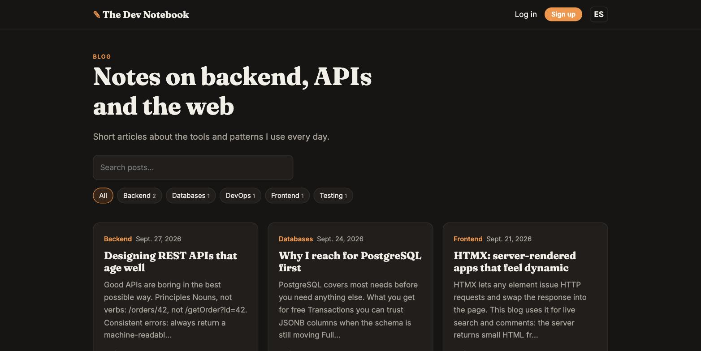

# Django Blog: The Dev Notebook

[](https://github.com/MigueIAngel/django-blog/actions/workflows/ci.yml)


A bilingual (English/Spanish) blog built with **Django 6**. Pages are rendered on the server with interactive bits powered by **HTMX**, and the same content is exposed through a **REST API** built with Django REST Framework.



**Live demo:** https://django-blog-demo.onrender.com · [Español](https://django-blog-demo.onrender.com/es/) · [API docs](https://django-blog-demo.onrender.com/api/docs/).

> Hosted on Render's free plan: the first request after a period of inactivity can take up to a minute while the service wakes up. Demo data is reset on every restart.

## Features

### Website
- Post list with pagination, category and tag pages
- **HTMX live search**: results update while typing, and only an HTML fragment is returned
- **HTMX comments**: posted without reloading the page, with out-of-band swaps to reset the form
- Markdown posts rendered to HTML and **sanitized with `nh3`** against XSS
- Reading time, related posts, SEO meta description
- Authoring: create and edit posts (author-only), drafts, preview and a "My posts" dashboard
- Sign up, log in and log out
- **Internationalization**: English at `/`, Spanish at `/es/` (`i18n_patterns`, `LocaleMiddleware`, a full `.po` catalog with plurals) and a language switcher
- Editorial design with automatic dark mode
- Customized Django admin with filters, search, inline comments and a bulk "publish" action

### REST API
- `GET/POST /api/posts/`, `GET/PATCH/DELETE /api/posts/{slug}/`
- Filters (`category`, `tag`, `author`, `status`), `search` and `ordering`
- `POST /api/posts/{slug}/comments/`
- `GET /api/categories/`
- Session and token authentication (`POST /api/auth/token/`), an author-only object permission and throttling
- OpenAPI 3 schema and Swagger UI at **`/api/docs/`**

## Tech stack

| Area | Tools |
|---|---|
| Backend | Django 6.1, Django REST Framework, django-filter, drf-spectacular |
| Frontend | Django templates, HTMX, custom CSS |
| Content | Markdown, nh3 (HTML sanitizer) |
| Database | PostgreSQL (SQLite for local development) |
| Quality | pytest-django (21 tests), Ruff |
| Deployment | Docker, gunicorn, whitenoise, GitHub Actions |

## Getting started

### Docker

```bash
docker compose up --build
```

Open http://localhost:8000. Demo data is created on the first run.

### Local development

```bash
python -m venv .venv && source .venv/bin/activate
pip install -r requirements-dev.txt
python manage.py migrate
python manage.py compilemessages
python manage.py seed_blog        # demo users and posts
python manage.py runserver
```

Demo accounts: `admin` / `admin12345` (superuser, author of the demo posts) and `reader` / `reader12345`.

### Tests

```bash
pytest
ruff check . && ruff format --check .
```

### Updating translations

```bash
python manage.py makemessages -l es --ignore=.venv
# edit locale/es/LC_MESSAGES/django.po
python manage.py compilemessages
```

## API example

```bash
TOKEN=$(curl -s -X POST localhost:8000/api/auth/token/ \
  -d "username=admin&password=admin12345" | jq -r .token)

curl -X POST localhost:8000/api/posts/ \
  -H "Authorization: Token $TOKEN" -H "Content-Type: application/json" \
  -d '{"title":"Hello API","body":"Written **via the API**","status":"published","tag_names":["api"]}'

curl "localhost:8000/api/posts/?category=backend&search=api&ordering=-published_at"
```

## Project structure

```
blog/
├── api/            # serializers, viewsets, permissions, router
├── management/     # seed_blog command
├── tests/          # pytest suite
├── forms.py
├── models.py       # Category, Tag, Post, Comment
├── urls.py
└── views.py        # class-based views + HTMX endpoints
config/             # settings, urls (i18n_patterns)
locale/es/          # Spanish translations
templates/          # base, blog pages, HTMX partials, auth
static/             # CSS, vendored HTMX
```

## License

MIT
